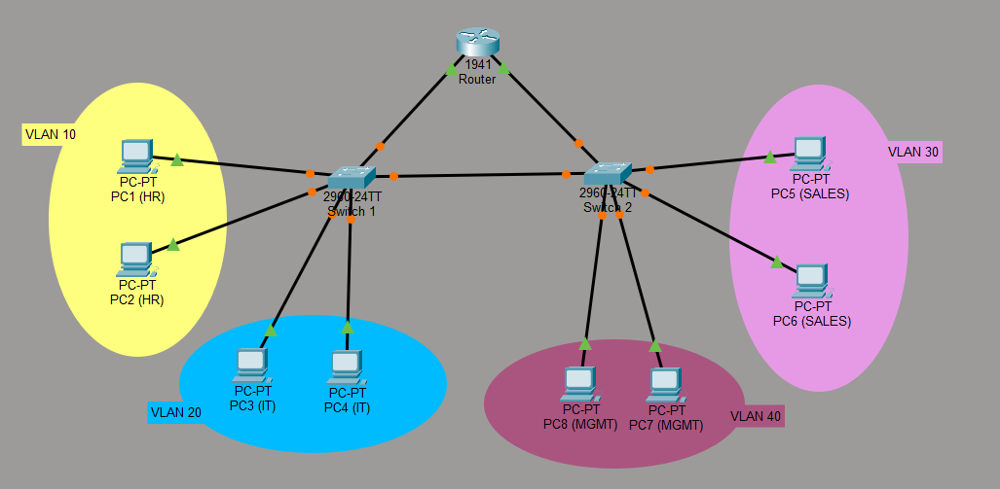
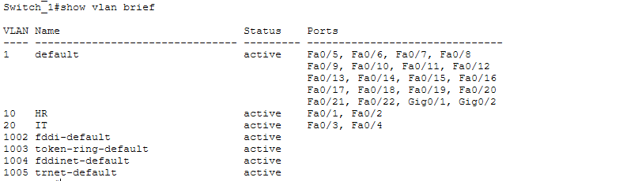
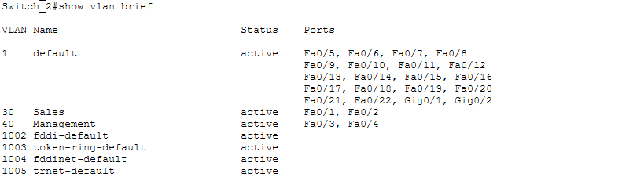
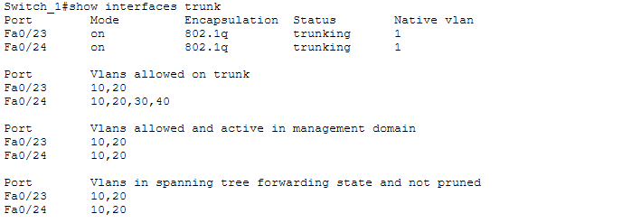
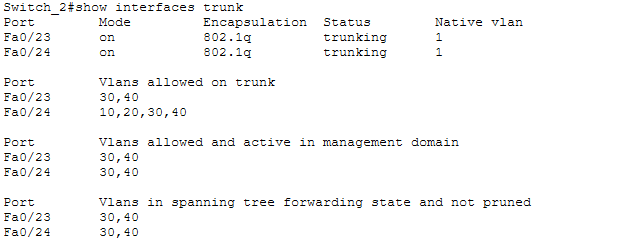
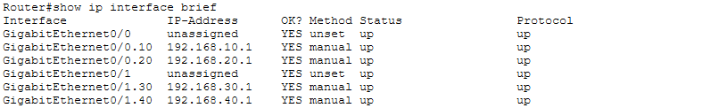
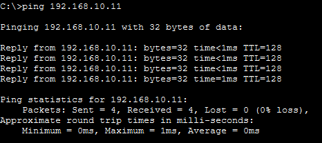
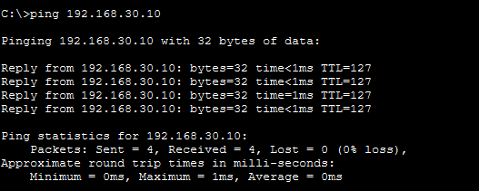

# VLAN Segmentation Lab

## 📌 Overview
This lab demonstrates enterprise network segmentation using VLANs and inter-VLAN routing (Router-on-a-Stick).  
The goal was to separate departments into different VLANs to improve security and reduce unnecessary broadcast traffic.

The network was built using Cisco Packet Tracer as part of my Network Security portfolio while studying at ISET'COM (Tunisia).

---

## 🎯 Objective
• Create VLANs on multiple switches  
• Assign PCs to the correct VLANs  
• Configure trunk links between switches and router  
• Configure inter-VLAN routing using Router-on-a-Stick  
• Test connectivity between devices  

This lab demonstrates practical network segmentation skills used in real enterprise environments.

---

## 🛠️ Tools Used
• Cisco Packet Tracer  
• Cisco Router  
• Cisco Layer-2 Switches  
• 8 PCs for testing  

---

## 🖧 Network Topology

The network contains 2 switches, 1 router, and 8 PCs distributed across 4 VLANs.

| VLAN | Department | Subnet            | Gateway        |
|------|------------|------------------|-----------------|
| 10   | HR/Admin   | 192.168.10.0/24  | 192.168.10.1    |
| 20   | IT         | 192.168.20.0/24  | 192.168.20.1    |
| 30   | Sales      | 192.168.30.0/24  | 192.168.30.1    |
| 40   | Management | 192.168.40.0/24  | 192.168.40.1    |

Each VLAN contains 2 PCs.

Topology Screenshot:

---

## ⚙️ Steps Performed

### 1️⃣ Created VLANs on Switches
Switch 1:

• VLAN 10 → HR/Admin  
• VLAN 20 → IT   

Switch 2:

• VLAN 30 → Sales  
• VLAN 40 → Management 

Verified with:

show vlan brief

### 2️⃣ Assigned Ports to VLANs
Example:

Switch 1:

Fa0/1–Fa0/2 → VLAN 10  
Fa0/3–Fa0/4 → VLAN 20   

Switch 2:

Fa0/1–Fa0/2 → VLAN 30  
Fa0/3–Fa0/4 → VLAN 40  

Verified with:

show vlan brief

Screenshots:

---

### 3️⃣ Configured Trunk Links
Configured trunk ports between switches and router to allow multiple VLANs.

Example:

Fa0/23 → trunk to router  
Fa0/24 → trunk between switches  

Verified with:

show interfaces trunk

Screenshot:

---

### 4️⃣ Configured Inter-VLAN Routing (Router-on-a-Stick)

Router interfaces:

G0/0.10 → 192.168.10.1  
G0/0.20 → 192.168.20.1  
G0/1.30 → 192.168.30.1  
G0/1.40 → 192.168.40.1  

Verified with:

show ip interface brief

Screenshot:

---

### 5️⃣ Connectivity Tests
• PCs in same VLAN → successful ping  
• PCs in different VLAN → routed via router

in our exemple i will use PC1 for the connectivity test

Screenshot:

---

## 🔐 Security Concepts Learned
• Network segmentation  
• VLAN isolation  
• Inter-VLAN routing  
• Enterprise network design  
• Reducing lateral movement in cyber attacks  

This is an important defense technique used in corporate networks.

---

## 📂 Files Included
• vlan-config.txt → Router and switch configurations  
• assets/ → Screenshots and topology diagrams  

---

## ✅ Result
Successfully created 4 VLANs across two switches and configured inter-VLAN routing using Router-on-a-Stick.  
All connectivity tests were successful.

This lab strengthened my practical Cisco networking and network security skills.

---

## 🚀 Future Improvements
• Add ACLs between VLANs  
• DHCP per VLAN  
• Firewall policies  
• Network monitoring  

---

## 👨‍💻 Author
Network Security student at ISET'COM (Tunisia) 
